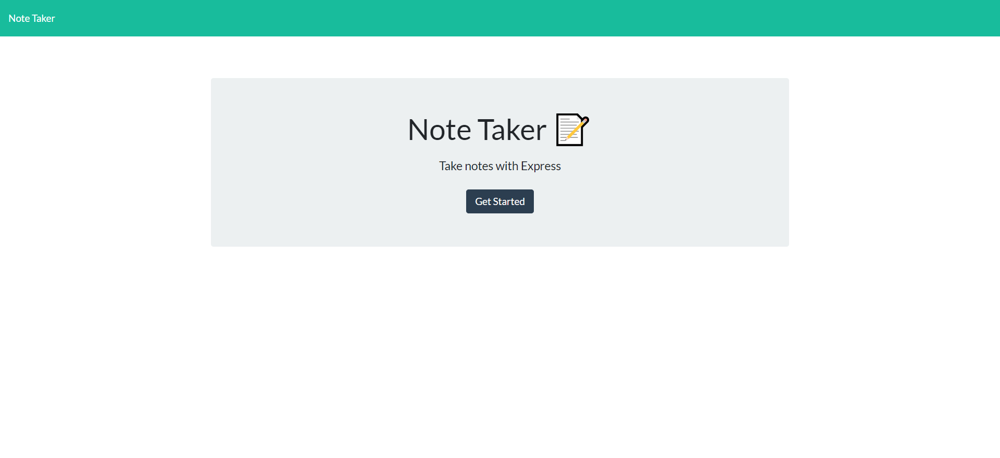
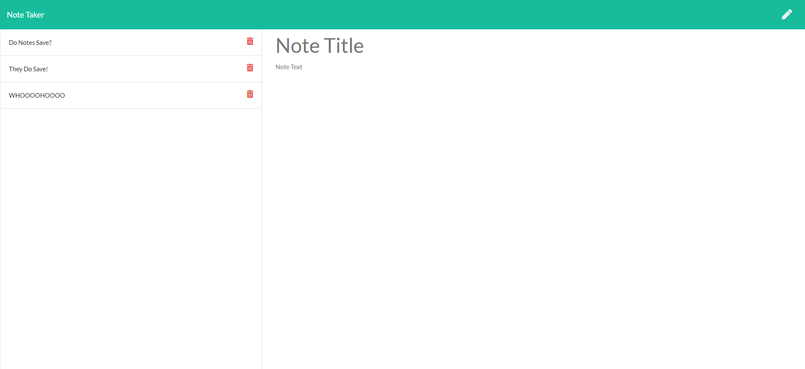
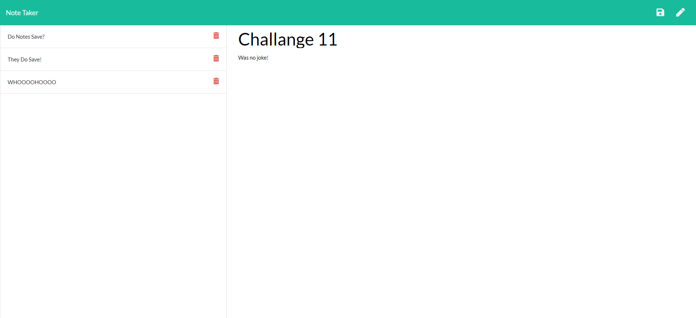

# The Best Note Taker

## Description
This website allows the user to create, save, and delete notes. If the user is to leave the browser, the date is stored and will be there upon next start up.

* Once both textarea fields have been filled out, the user can click the save icon in the top right corner, and bring the saved note to the left column where it will be stored.
* In order to create a new note, the user must click the pencil icon in the top right corner.
* If the user wishes to delete a note, they are to click on the red trash icon.

### Screenshots

### Link
[The Best Note Taker](https://the-best-note-taker.herokuapp.com/notes)